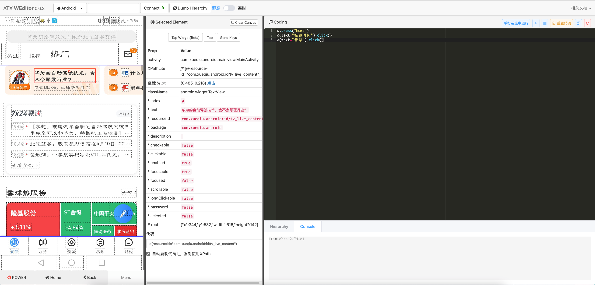

仓库简介：
1. 这是一个appium的简单框架封装(基于组合的设计模式，易于扩展)，用例编写基于PageObject的思想。
2. page_obejct：po的简单例子--企业微信添加成员。
3. appium_example：appium常用的api的简单运用。
4. 目前有日志、错误截图、测试过程的视频录制、黑名单定位排除意外弹窗对测试的干扰，输出allure2-html报告
5. 接触UI自动化测试3年多，写这个算是对 个人工作中 UI自动化测试的一个总结。
6. app页面元素定位可以使用 alibaba开源的 web-editor, 该工具相当于appium-desktop定位的web版，
   但是更方便易用，启动界面如下，更详细的使用请百度。
   

